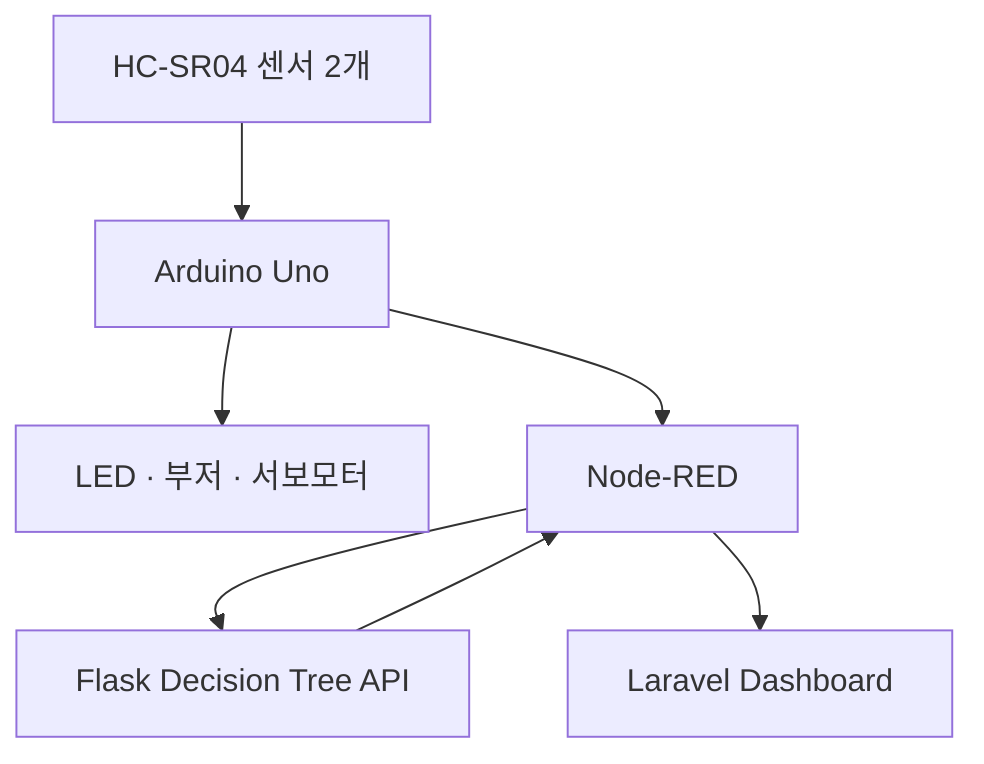

# SafeRail

> Arduino 센서, 규칙 기반 안전 제어, Decision Tree 이상 감지, Node-RED 통합, Laravel 모니터링을 결합한 스마트 철도 건널목 프로토타입

SafeRail은 무차단 철도 건널목의 접근·통과 상황을 두 개의 초음파 센서로 감지하고, 경고등·부저·차단기를 제어하면서 웹에서 실시간 상태를 확인할 수 있도록 만든 팀 프로젝트입니다. AI는 차단기를 직접 제어하는 안전 장치가 아니라, 센서 이벤트가 정상 통과인지 또는 이상 상황인지를 검증하는 보조 계층으로 사용했습니다.

- Project period: 2026.07–2026.08
- Collaboration: KNU × POLIJE
- Type: Arduino Smart City team project
- Status: Functional prototype

## 문제 정의

저비용 철도 건널목에서는 열차 접근 경고와 현장 상태 확인이 제한적일 수 있습니다. SafeRail은 다음 문제를 하나의 시스템으로 연결하는 것을 목표로 했습니다.

- 양방향 열차 접근 감지
- LED·부저·서보모터를 이용한 현장 경고
- 센서 오류와 장시간 차단 상황 감지
- 정상 통과와 이상 이벤트 분류
- 웹 대시보드 기반 실시간 모니터링

## 시스템 구조



### 안전 설계 원칙

SafeRail은 AI 예측만으로 차단기를 제어하지 않습니다.

1. Arduino가 센서 입력을 바탕으로 기본 경고와 차단 동작을 수행합니다.
2. Node-RED가 두 센서의 감지 순서, 시간차, 지속시간과 오류를 이벤트 단위로 정리합니다.
3. Decision Tree는 이벤트를 분류하고 `open_candidate`를 보조 정보로 반환합니다.
4. 신뢰도가 낮거나 센서 오류가 발생하면 시스템은 차단기를 임의로 개방하지 않는 fail-safe 방향을 유지합니다.
5. `SENSOR_FAULT`는 학습 모델이 아니라 Node-RED의 결정론적 규칙으로 처리합니다.

## 주요 기능

- 두 개의 HC-SR04 센서를 이용한 양방향 접근·통과 감지
- 빨강·노랑·초록 LED, 부저, 서보모터 제어
- Node-RED 기반 시리얼 데이터 파싱과 이벤트 집계
- Decision Tree 기반 통과 검증 및 이상 감지
- Flask REST API를 통한 실시간 추론
- Laravel 기반 Sensor Grid와 AI Analytics 화면
- 센서 장시간 점유, 노이즈 및 알 수 없는 패턴 구분

## AI 모델

### 분류 라벨

| Label | Samples | Meaning |
| --- | ---: | --- |
| `NORMAL_PASS` | 20 | 정상적인 센서 통과 순서 |
| `BLOCKED` | 20 | 한쪽 센서가 장시간 점유된 상태 |
| `NOISE` | 10 | 순간적이거나 불안정한 센서 입력 |
| `UNKNOWN` | 6 | 기존 패턴으로 설명하기 어려운 이벤트 |

총 56개의 프로토타입 센서 이벤트를 사용했습니다.

### 입력 특징

- `direction`
- `arduino_state`
- `gap_ms`
- `duration_A_ms`, `duration_B_ms`
- `error_count_A`, `error_count_B`
- `distance_A_cm`, `distance_B_cm`

### 평가 결과

| Metric | Result |
| --- | ---: |
| Holdout accuracy | 1.000 |
| Mean 5-fold cross-validation accuracy | 0.914 |

Holdout 테스트는 14개 표본만 사용했고 `UNKNOWN` 테스트 표본은 1개이므로, 정확도 1.000을 실제 환경의 일반화 성능으로 해석하지 않습니다. 대표 성능으로는 교차검증 평균 0.914를 사용하며, 더 많은 실제 환경 데이터 수집이 필요합니다.

## 기술 스택

| Layer | Technology |
| --- | --- |
| Hardware | Arduino Uno, HC-SR04 ×2, Servo, LED, Buzzer |
| Integration | Node-RED, Serial, HTTP |
| AI/API | Python, Flask, pandas, scikit-learn, joblib |
| Web | Laravel, PHP, JavaScript, Vite |
| Development | GitHub Desktop, VS Code |

## 저장소 구조

```text
saferail-smart-crossing/
├── arduino/
│   └── saferail_controller/
├── node-red/
│   └── flows/
├── ai/
│   ├── api/
│   ├── training/
│   ├── models/
│   ├── results/
│   └── requirements.txt
├── data/
├── web/
│   └── laravel-dashboard/
└── docs/
    └── images/
```

## 실행 방법

### 1. Python 환경과 모델 학습

저장소 루트에서 다음 명령을 실행합니다.

```powershell
python -m venv .venv
.\.venv\Scripts\Activate.ps1
pip install -r .\ai\requirements.txt
python .\ai\training\train_decision_tree.py
```

학습된 모델은 `ai/models`에, 평가 결과는 `ai/results`에 생성됩니다.

### 2. Flask 추론 API

```powershell
python .\ai\api\predict_api.py
```

- Health check: `GET http://127.0.0.1:5050/health`
- Prediction: `POST http://127.0.0.1:5050/predict`

요청 예시:

```json
{
  "direction": "A_TO_B",
  "arduino_state": "SAFE",
  "gap_ms": 850,
  "duration_A_ms": 1200,
  "duration_B_ms": 1100,
  "error_count_A": 0,
  "error_count_B": 0,
  "distance_A_cm": 8.5,
  "distance_B_cm": 9.2
}
```

### 3. Node-RED

1. Node-RED 편집기에서 `node-red/flows/saferail-flow.json`을 Import합니다.
2. Arduino가 연결된 시리얼 포트를 설정합니다.
3. Decision Tree 요청 주소를 `http://127.0.0.1:5050/predict`로 설정합니다.
4. Deploy 후 센서 이벤트와 API 응답을 확인합니다.

### 4. Laravel 대시보드

```powershell
cd .\web\laravel-dashboard
composer install
npm install
Copy-Item .env.example .env
php artisan key:generate
php artisan migrate
npm run dev
```

별도 터미널에서 다음 명령을 실행합니다.

```powershell
php artisan serve
```

환경에 맞게 `.env`의 데이터베이스 및 연동 설정을 구성해야 합니다. 실제 `.env` 파일은 저장소에 포함하지 않습니다.

## 한계와 개선 계획

- 실제 철도 환경이 아닌 축소형 프로토타입에서 수집한 데이터
- 클래스별 데이터 수 불균형, 특히 `UNKNOWN` 데이터 부족
- 초음파 센서의 각도·반사·거리 변화에 대한 추가 실험 필요
- 카메라 또는 추가 센서를 이용한 교차 검증 필요
- 엣지 디바이스 배포와 추론 지연시간 측정 필요
- 장애 상황별 fail-safe 시험 시나리오 확대 필요

## 담당 역할

이 프로젝트는 팀 프로젝트이며, 개인 담당 범위는 다음과 같습니다.

- Node-RED 플로우 구성: Arduino 시리얼 데이터 파싱, 센서 이벤트 집계 및 상태 분기
- AI 학습용 센서 이벤트 수집과 `NORMAL_PASS`, `BLOCKED`, `NOISE`, `UNKNOWN` 라벨링
- Decision Tree 학습 파이프라인 구현, 교차검증 및 결과 분석
- Flask 기반 `/health`, `/predict` 추론 API 구현
- Node-RED에서 Flask API를 호출하고 예측 결과를 처리하도록 연동
- Node-RED의 센서 상태·AI 결과를 팀원이 개발한 Laravel 웹사이트에 전달하도록 시스템 연동

Laravel 웹사이트의 화면 및 백엔드 구현은 다른 팀원이 담당했으며, 본인은 Node-RED와 AI 결과를 해당 웹사이트에 연결하는 통합 작업을 담당했습니다.

## Team

Developed as part of a KNU × POLIJE Arduino Smart City collaboration project.
